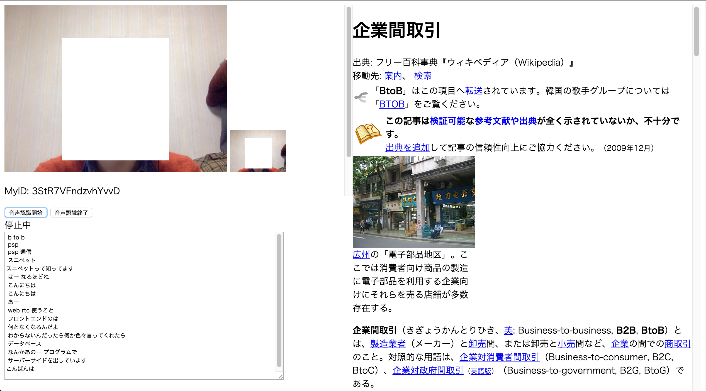

# リアルタイムエンジニア用語解析ビデオ通話
## 概要
エンジニアとビデオ通話している時に会話をテキストに出力し、わからない単語が出てきた時に、リアルタイムでWeb検索(もしくはDB処理）を行い、表示してくれるシステム。

## ユーザ
エンジニアとの会話でわからない単語が多くて困っている人

## 使うもの
- WebRTC：P2Pのビデオ通話ライブラリ
- WebSpeechAPI：音声認識しテキストに書き出すためのAPI
- BingSearchAPI：単語をWeb検索するためのAPI

## システム画像
現在のシステムのスクリーンショットです。

## 使い方
1. ビデオチャット相手のIDをPeerIDのテキストボックスに入力し、Start Callボタンを押す
2. ビデオがつながるので、音声認識開始ボタンを押す
3. 会話をする。

会話をするとリアルタイムにテキストに書き出され、その中に該当するエンジニア用語があると、自動でWeb検索をかけて結果を表示してくれます。

## 該当するエンジニア用語
サーバーサイド/クライアントサイド/フロントエンド/B to B/B to C/P2P/スニペット/WebRTC/インフラ/オープンデータ/オープンソース/プラットフォーム/C#/java/swift/objective-c/php/javaScript/デッドロック/フレームワーク/CAD/HTML/ワールドワイドウェブ/グラボ/マークダウン/emacs/Unix/Linux
