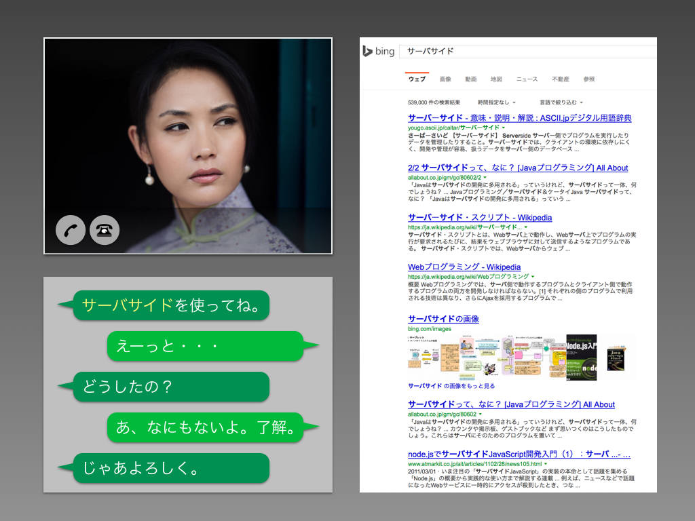

# リアルタイムエンジニア用語解析ビデオ通話
## 概要
エンジニアとビデオ通話している時に会話をテキストに出力し、わからない単語が出てきた時に、リアルタイムでWeb検索(もしくはDB処理）を行い、表示してくれるシステム。

## ユーザ
エンジニアとの会話でわからない単語が多くて困っている人

## 使うもの
- WebRTC：P2Pのビデオ通話ライブラリ
- WebSpeechAPI：音声認識しテキストに書き出すためのAPI
- BingSearchAPI：単語をWeb検索するためのAPI

## イメージ
システムのイメージです。実際の画面ではございません。

## 現状
現在のシステムのスクリーンショットです。

 

